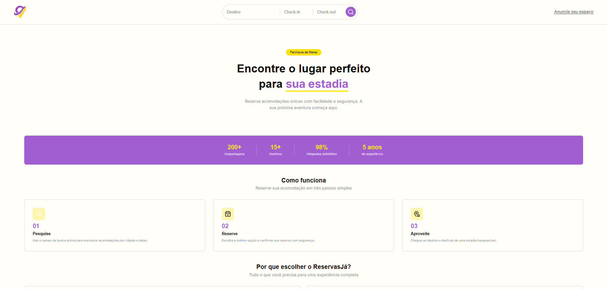
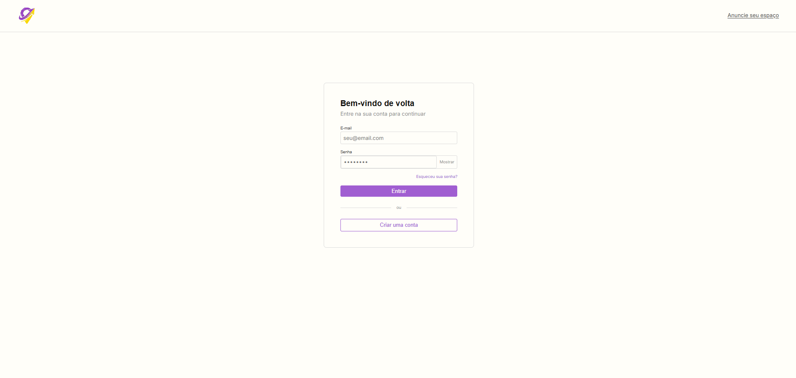
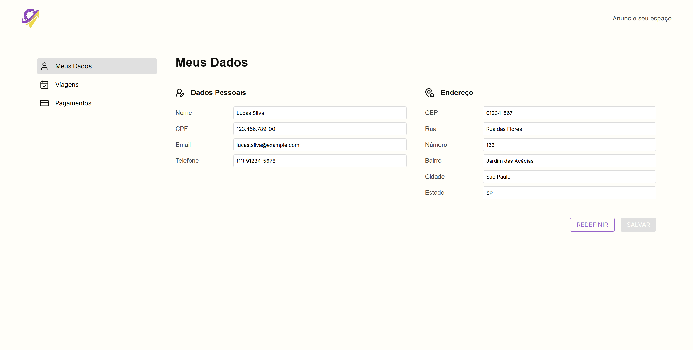
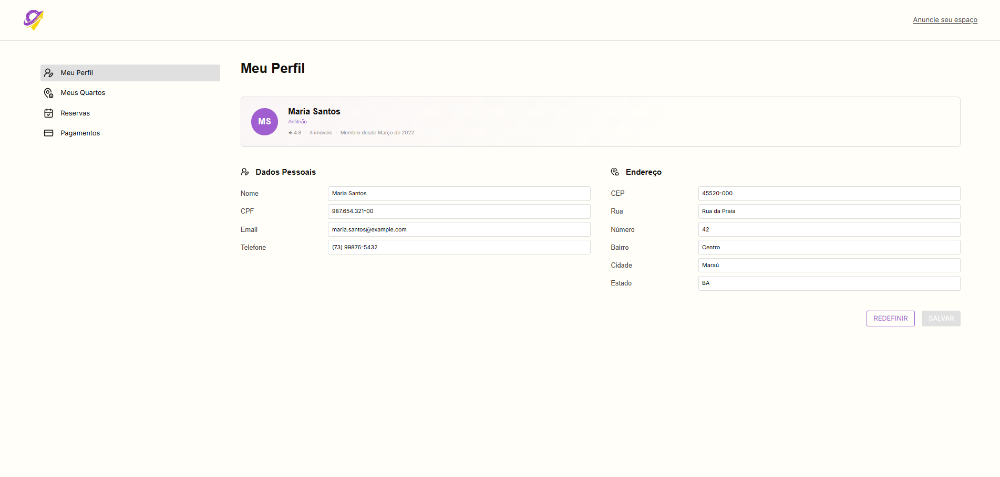

# ReservasJá - Gestão de Hospedagem

O ReservasJá é um sistema desenvolvido para modernizar e escalar o processo de aluguel de quartos na Península de Maraú. O projeto foca em transformar residências locais em opções de hospedagem organizadas, utilizando uma arquitetura robusta e práticas modernas de desenvolvimento.

---

## Estrutura do Projeto

```bash
/frontend  → Interface (HTML, CSS, JS)
/backend   → API (Java + Spring Boot)
```

## Tecnologias Utilizadas

- Linguagem: Java 
- Framework: Spring Boot (API REST) 
- Arquitetura: Camadas (Controller, Service, Repository, Model) 
- Persistência de Dados: MySQL 
- Testes: 

## Diagrama de Classe


---

## Cartões CRC

[Clique aqui para acessar o Cartão CRC](docs/crc/Cartões%20CRC.pdf)

---

## Telas










---

## Soluções Arquiteturais

### Singleton

O padrão Singleton foi aplicado na classe ConfiguracaoGlobalSistema para centralizar as regras globais do sistema.

A existência de múltiplas instâncias dessa configuração poderia gerar inconsistências, como diferentes regras de cálculo sendo aplicadas simultaneamente em partes distintas do sistema.

O Singleton garante que todas as classes compartilhem a mesma instância de configuração, promovendo:

- Consistência nas regras de negócio
- Facilidade de manutenção
- Alterações centralizadas

Isso resolve o problema de duplicação de regras e evita divergências no comportamento do sistema.

### Strategy

O padrão Strategy foi aplicado na parte de tarifação do sistema, permitindo que diferentes regras de cálculo sejam escolhidas em tempo de execução sem alterar o fluxo principal da aplicação.

No backend, isso é representado pela interface `RegraTarifacao`, que define o contrato para aplicação das tarifas, e pela classe `TarifacaoContext`, responsável por selecionar e executar a estratégia adequada.

Entre as estratégias implementadas estão:

- `TarifaPadrao` - regra base de cálculo
- `TarifaAltaTemporada` - acréscimo em períodos de alta temporada
- `TarifaBaixaTemporada` - desconto em períodos de baixa temporada
- `TarifaPromocional` - desconto aplicado em condições promocionais
- `TarifaClienteFrequente` - desconto para clientes recorrentes
- `TarifaFeriado` - acréscimo em feriados ou datas de maior demanda

Esse padrão facilita a manutenção e a evolução das regras de preço, pois novas tarifas podem ser adicionadas sem impactar as regras já existentes.

### Observer

O padrão Observer foi aplicado ao sistema de notificações, permitindo que um mesmo evento de aluguel seja propagado para múltiplos canais de comunicação de forma desacoplada.

Nesse fluxo, o `NotificacaoDispatcher` atua como sujeito central, notificando os observadores registrados sempre que ocorre um evento relevante, como criação ou atualização de aluguel.

As implementações de observadores incluem:

- `EmailChannel`
- `SMSChannel`
- `WhatsAppChannel`
- `NotificacaoInternaChannel`

O evento base `AluguelEvent` carrega as informações necessárias para que cada canal trate a notificação de acordo com sua responsabilidade.

Com isso, o sistema ganha flexibilidade para adicionar novos canais de notificação sem alterar a lógica principal de disparo dos eventos.

