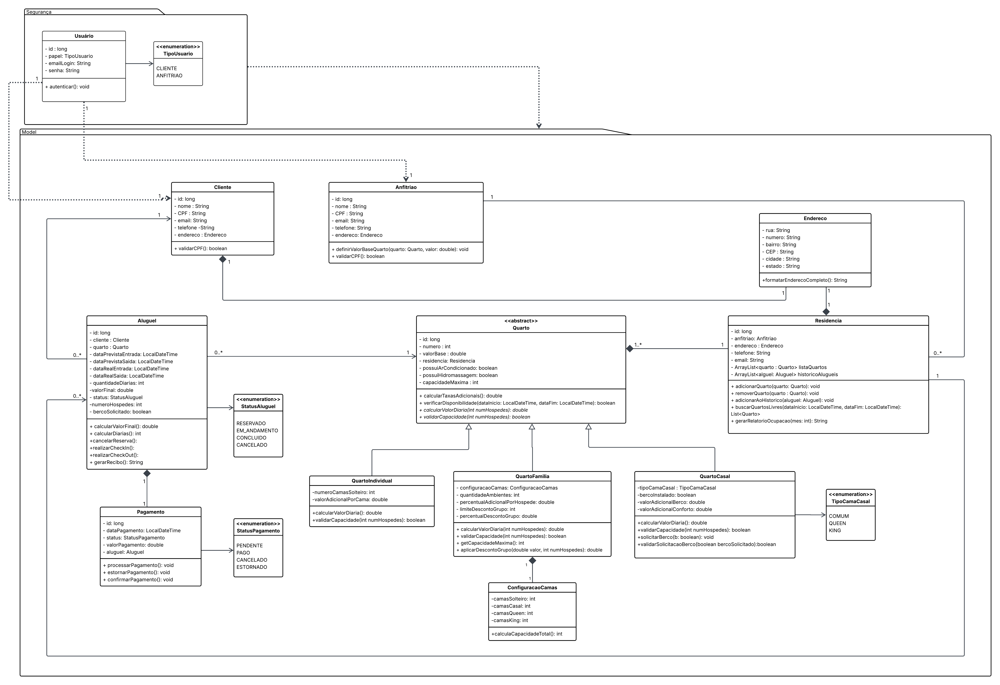

# ReservasJá - Gestão de Hospedagem

O ReservasJá é um sistema desenvolvido para modernizar e escalar o processo de aluguel de quartos na Península de Maraú. O projeto foca em transformar residências locais em opções de hospedagem organizadas, utilizando uma arquitetura robusta e práticas modernas de desenvolvimento.

---

## Estrutura do Projeto

```bash
/frontend  → Interface (HTML, CSS, JS)
/backend   → API (Java + Spring Boot)
```

## Tecnologias Utilizadas

- Linguagem: Java 
- Framework: Spring Boot (API REST) 
- Arquitetura: Camadas (Controller, Service, Repository, Model) 
- Persistência de Dados: MySQL 
- Testes: 

## Diagrama de Classe



---

## Cartões CRC

[Clique aqui para acessar o Cartão CRC](docs/crc/Cartões%20CRC.pdf)

---

## Telas


